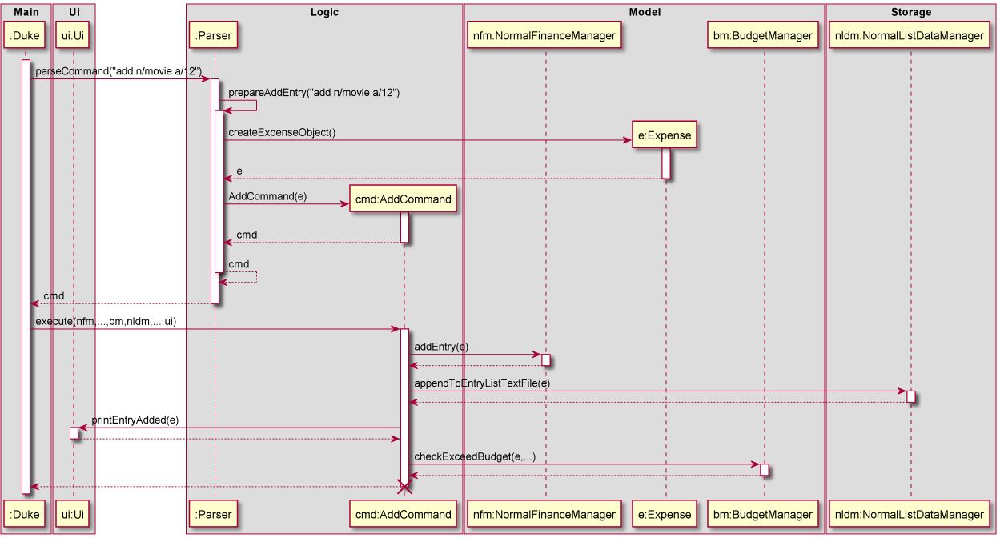
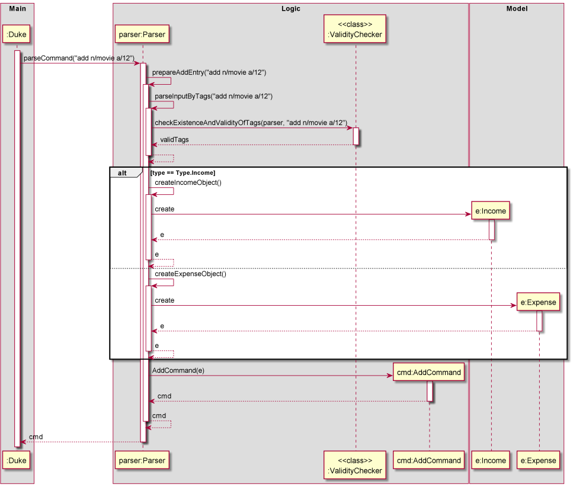
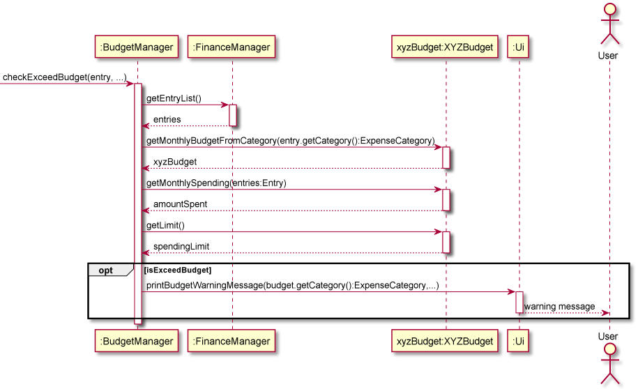

# Developer Guide

### Table of Content

- [Acknowledgements](#acknowledgements)
- [Design](#design)
    - [System Architecture](#sys-arch)
    - [Ui Component](#text-ui)
    - [Logic Component](#logic)
    - [Model Component](#model)
        - [FinanceManager and Entry Components](#finance)
        - [Budget Component](#budget)
    - [Storage Component](#storage)
- [Implementation](#implementation)
- [Product Scope](#scope)
    - [Target user profile](#target)
    - [Value proposition](#value)
- [User Stories](#stories)
- [Non-Function Requirements](#nf-req)
- [Glossary](#glossary)
- [Instructions for manual testing](#manual-test)
    - [Adding an Entry](#Adding)
    - [Deleting an Entry](#delete)
    - [Editing an Entry](#edit)
    - [Adding a Recurring Entry](#Add-recurring-entry)
    - [Deleting a Recurring Entry](#Delete-recurring-entry)
    - [Editing a recurring Entry](#Edit-recurring-entry)
    - [Viewing entries](#View)
    - [Deleting all entries](#deleteAll)
    - [Setting Budget](#Set-budget)
    - [Viewing Budget](#View-budget)

## <a name="acknowledgements"></a>Acknowledgements

- Inspiration for App Idea and OOP Structure:
- Inspiration for User Guide and Developer Guide: AddressBook (Level 2) 

  [https://se-education.org/addressbook-level3/DeveloperGuide.html](https://se-education.org/addressbook-level3/DeveloperGuide.html ) 

  [https://se-education.org/addressbook-level3/UserGuide.html](https://se-education.org/addressbook-level3/UserGuide.html)

## <a name="design"></a>Design

### <a name="sys-arch"></a>System Architecture


The above **System Architecture** diagram shows the high-level design of Mint.

On launch, the `Main` class initialises the app components in the correct sequence and links them up with each other, in
the correct sequence.

Apart from `Main`, Mint comprises six main components, namely:

- `Ui`: The UI of the App
- `Logic`: Make sense of user input and execute command
- `Model`: Holds the data of the App and performs actions on the data.
- `Storage`: Reads from and writes to [`LocalStorage`](#local-storage).

The four components interact with each other.

### <a name="text-ui"></a>Ui Component


The UI consists of a `Ui` class that represents the interface that the user interacts with.

The Ui component,

* takes in user inputs.
* pass them either to the `Logic` component or `Storage` component.
* outputs entries requested by the user.

### <a name="logic"></a>Logic Component

Here is a (partial) class diagram of the `Logic` component.


How the `Logic` component works:

1. When `Logic` is called upon to parse a command, it uses `Parser` class to parse the user command.
2. The `Parser` prepares to return a `Command` object (more precisely, an object of one of its 
   subclasses e.g.,`AddCommand`) by parsing the arguments.
3. `Parser` encapsulates the details of the query as an `Entry` object from `Model`.
4. `Parser` returns a `Command` object, which is executed by `Main`.
5. The `Command` can communicate with the `Model` when it is executed 
6. The `Command` saves the resulting data by using the `Storage`.
7. The result is printed to the user by the `Ui`.
   (e.g. to add a recurring entry)

The Sequence Diagram below illustrates the interactions within the `Logic` component for the 
`parseCommand("add n/movie a/12")` API call. For detailed implementation of `Parser` class, refer to [Implementation](#implementation) section.



> As the `execute` method of `Duke` class takes in 7 arguments but only some are used in this
> command's case, unused arguments are represented as `...` to focus on the used arguments. Same reason for `checkExceedBudget` applies.
> This also applies for the sequence diagrams in the following sections.

### <a name="model"></a>Model Component

The `Model` package consists of three sub-components: `FinanceManager`, `Entry`, and `Budget`.

##### <a name="finance"></a>FinanceManager and Entry Components


The `FinanceManager` component,

- stores all the entry data i.e., all `Entry` objects.
    - `NormalFinanceManager` object stores all the `Income` and `Expense` objects
    - `RecurringFinanceManager` stores all the `RecurringIncome` and `RecurringExpense` objects
- performs action on the list of `Entry` objects (e.g., add, delete, etc.)
- depends on the `Ui` component as some action needs confirmation from the user (e.g. For edit, after the user chooses
  the entry to edit, the user needs to provide the fields to be edited.)

The `Entry` component,

- stores information about the individual `Entry` object.
- does not depend on any of the other three components.

#### <a name="budget"></a>Budget Component


The `Budget` package consists of a `BudgetManager` and the `Budget`'s each of the seven `ExpenseCategory`'s.

- `Budget` is an abstract class
- `XYZBudget`(`XYZ` is a placeholder for the specified budget e.g., `FoodBudget`), inherits `Budget` and its attributes.
- `BudgetManager` stores a list of the seven `ExpenseCategory`'s.
- Currently, `BudgetManager` only interacts in 2 ways
    - when user want to set budget for a specific category
    - when other parts of the app requires the list of budgets e.g., `Ui` needs the list to print to the user, or
      `FinanceManager` needs to know if the user is nearing their spending limit to notify them.

### <a name="storage"></a>Storage Component

**How the `Storage` component works:**

**1. Loading the lists from the stored files:**


> For ease of visualization, since the logic for all the different lists are the same, we have broken it down to show
> one example using the diagram

1. When the program is executed, all the objects including the `BudgetDataManager`, `DataManagerActions`,
   `NormalListDataManager` and `RecurringListDataManager` would be created.
2. The programme would then load all the stored content from the lists which records the user's previously recorded
   normal expenditure, recurring expenditure, and the spending limits they set for each category.
3. Upon detection, missing text files, and the required directory would be created.

**2. General logic for each command:**


1. After the command is extracted from the `Parser`, `Duke` would call the respective command class. In the case of the
   add function, the `AddCommand` class would be called.
2. In the `AddCommand` class, after the add command has been successfully performed, a method call to
   `appendToEntryListTextFile` would activate the `NormalListDataManager` class for which the added entry would be
   appended to an external text file.

**The `Storage` component:**

1. Can save all the `recurringEntryList`, `budgetList` and the `entryList` in a text file. It is also able to read the
   data from the respective text files and read them back into the corresponding objects.
2. Has four different classes. `DataManagerActions` comprises the common components used by the other two classes,
   `BudgetListDataManager`, `RecurringListDataManager` and `NormalListDataManager`. All of these classes inherit from
   the `DataManagerActions` class.

## <a name="implementation"></a>Implementation

### Parser

The Sequence Diagram below illustrates the detailed interactions within the `Logic` component, focusing on `Parser` class,
for the `parseCommand("add n/movie a/12")` API call.



When `parseCommand("add n/movie a/12")` is called,

1. The `Parser` prepares to return a `Command` object (more precisely, an object of one of its
   subclasses e.g.,`AddCommand`) by parsing the arguments.
2. Parsed fields (e.g., `name`, `amount`) are checked if they are valid through `ValidityChecker` class's static methods.
3. If the parsed `type` is `Type.Income`, it creates an `Income` object based on the parsed fields.
4. Else, which means the parsed `type` is `Type.Expense`, it creates an `Expense` object based on the parsed fields.
>If the command is related to `RecurringEntry` (e.g.,`AddRecurringCommand`), `RecurringIncome` object is created for `Type.Income`,
> and `RecurringExpense` object is created for `Type.Expense`.
5. The `Command` object is created, and returned to the `Duke` class.

### BudgetManager

Below is a sequence diagram of how the `BudgetManager` interacts with other classes to check if user exceeds their
budget.



Note: `XYZBudget` (`XYZ` is a placeholder for the specified budget e.g., `FoodBudget`)

When `checkExceedBudget(entry,...)` is called, assuming `entry` is of type `Expense`,

1) `BudgetManager` will fetch both `Entries` and `RecurringEntries` from their respective `FinanceManager`.
    - For readability purposes, we will denote all entries as `entries` and group both `NormalFinanceManager`
      and `RecurringFinanceManager` as `FinanceManager`.

2) `BudgetManager` will then retrieve the specific `XYZBudget` corresponding to `entry`'s category.

- `BudgetManager` now have reference to the specific `XYZBudget`.

3) Using the same instance of `XYZBudget`, `BudgetManager` will
    1) get monthly spending corresponding to the `entry`'s category.
    2) get limit/budget set for `XYZBudget`, which is of `entry`'s category.

4) Lastly, `BudgetManager` will check if user has exceeded their threshold for that specific category and prints a
   warning message to the user if they have done so.

#### Design considerations

Aspect: how to check whether user exceeded budget

- Option 1 (current choice): iterate through the list of entries each time `checkExceedBudget(entry,...)` is called and
  return the `amountSpent` and `spendingLimit` corresponding to the current `Entry`'s category. Only happens when
  user `add` entries.
    - Pros: Easy to implement. Less coupling of components.
    - Cons: More LOC and slower runtime.

- Option 2: instantly updates the budget's monthly spending when user `add`, `delete` or `edit` (recurring)
  entries.
    - Pros: Faster runtime and more responsive warning messages (such as when user `edit` the `Entry` to an overspent
      budget.)
    - Cons: massive coupling of components.

We picked option 1 as it was in line with our goal of making our code OOP with separate components. Initially, we
pursued option 2 and found it hard to add functionalities and do unit testing due to the coupling available. Option 2
also meant to make the live updating work, we had to deal with 7 commands: `add`, `addR`, `delete`, `deleteR`
, `deleteAll`, `edit` and `editR`. Hence, we went with Option 1 due to scalability.


## <a name="scope"></a>Product scope

### <a name="target"></a>Target user profile

- has a need to track their expenses and savings
- prefer desktop apps over other types
- can type fast
- prefers typing to mouse interactions
- is reasonably comfortable using CLI apps

### <a name="value"></a>Value proposition

A smart and simple way to keep track of your expenses

## <a name="stories"></a>User Stories

|Version| As a ... | I want to ... | So that I can ...|
|--------|----------|---------------|------------------|
|v1.0|new user|see usage instructions|refer to them when I forget how to use the application|
|v1.0|user|add expense|
|v1.0|user|delete expense|remove entries that I no longer need|
|v1.0|user|view past expenses|keep track of my spending|
|v1.0|user|edit past expenses|avoid deleting the entire expense if I only made a small error while keying it in|
|v2.0|user|categorize expenses|see which areas I am overspending|
|v2.0|user|set spending limit|cut down on unnecessary spending|
|v2.0|user|add income|better estimate my spending capacity|
|v2.0|user|sort spending by amount|see which expenditure is taking up the budget|
|v2.0|user|find a particular entry by name, amount or any detail|locate an Entry without having to go through the entire list|
|v2.0|user|add subscriptions/incomes|keep track of them and automatically take them into account every month or year|
|v2.0|user|view total money I have |see if I have saved enough for the future.|
|v2.0|user|filter entries by date or type|see cash flow in a particular period|

## <a name="nf-req"></a>Non-Functional Requirements

- Should work on any [*mainstream Operating Systems*](#os) as long as Java `11` or higher has been installed on it.
- Each command (Add, delete, edit, view) should be executed within 1 second of the user input.
- Users can use the application throughout the week at any time during the day. In the case of unexpected downtime, all
  features will be available again within 24 hours.
- If the commands have errors, they can be fixed within 24 hours.
- The application’s interface has to be intuitive and easy to use.

## <a name="glossary"></a>Glossary

* <a name="os"></a>**Mainstream Operating Systems** - Windows, macOS, *NIX
* <a name="local-storage"></a>**LocalStorage** - Refers to user's hard disk storage

## <a name="manual-test"></a>Instructions for manual testing

> We define an `Entry` as an expense/income. 

> Tags in square brackets are optional
> e.g., `n/NAME [d/DATE]` can be used as `n/burger d/2021-10-20` or as `n/burger`

### <a name="Adding"></a>Adding an `Entry`

1. **Prerequisites**: The list must have been initialized.
2. **Test case**: `add a/15 d/2021-12-03 n/Textbook c/7`
   
   Expected:
   - Program would print a message to notify the user that the `Entry` has been added.
     An `expense` would then be added to the list. Optional fields that are missing would be set to the default pre-determined by the programme.

    ```
    add a/15 d/2021-12-03 n/Textbook c/7
    I've added: Expense  | OTHERS | 2021-12-03 | Textbook | $15.00
    ```

3. **Test case**: `add income a/15 d/2021-12-03 n/Selling Textbooks c/7`

   Expected:
    - Program would print a message to notify the user that the `Entry` has been added.
      An `income` would then be added to the list. Optional fields that are missing would be set to the default pre-determined by the programme.

    ```
    add income a/15 d/2021-12-03 n/Selling Textbooks c/7
    I've added: Income  | OTHERS | 2021-12-03 | Selling Textbooks | $15.00
    ```

4. **Test case**: `add a/15 d/2021-12-03 n/Textbook`

    Expected:
    - Program would print a message to notify the user that the `Entry` has been added.
      An `expense` would then be added to the list. Optional fields that are missing would be set to the default pre-determined by the programme.
      
    ```
    add a/15 d/2021-12-03 n/Textbook
    I've added: Expense  | OTHERS | 2021-12-03 | Textbook | $15.00
    ```

5. **Test case**: `add income a/15 d/2021-12-03 n/Selling Textbooks`

   Expected:
    - Program would print a message to notify the user that the `Entry` has been added.
      An `income` would then be added to the list. Optional fields that are missing would be set to the default pre-determined by the programme.

    ```
    add income a/15 d/2021-12-03 n/Selling Textbooks
    I've added: Income  | OTHERS | 2021-12-03 | Selling Textbooks | $15.00
    ```

### <a name="delete"></a>Deleting an `Entry`

1. **Prerequisites**: List all entries using the `view` command. Multiple entries in the list.

2. **Test case**: `delete n/Movie c/1` 

    Expected:
   - If there is one `Entry` that matches the query, it asks user if the user wants to delete the found Entry.
     - Input `y`, then it would delete the `Entry` and tell that it is deleted.
     ```
       delete n/Movie c/1
       Is this what you want to delete?
           Expense  | ENTERTAINMENT | 2021-11-03 | Movie | $20.00
       Type "y" if yes. Type "n" if not.
       y
       I have deleted: Expense  | ENTERTAINMENT | 2021-11-03 | Movie | $20.00
     ```
     
   - If there are multiple entries that match the query, it asks the user to choose the index of Entry that the
   user wants to delete from a given list.
     - Enter `2`, then it would delete the second `Entry` shown and tell that it is deleted.
     ```
       delete n/movie c/1
       Here is the list of items containing the keyword.
        Index |   Type  |   Category    |    Date    |      Name       | Amount | Every |   Until
          1   | Expense | ENTERTAINMENT | 2021-12-25 | Christmas Movie |-$15.00 |       |
          2   | Expense | ENTERTAINMENT | 2021-11-03 |      Movie      |-$20.00 |       |
        Enter the index of the item you want to delete. To cancel, type "cancel"
        2
        I have deleted: Expense  | ENTERTAINMENT | 2021-11-03 | Movie | $20.00
     ```
   - If there is no entry that matches the query, it tells that there is no matching `Entry` in the list.
     ```
       delete n/movie c/1
       Hmm.. That item is not in the list.
     ```
     
3. **Test case**: `delete d/2021-11-04` 

Expected:
   - If there is one `Entry` that matches the query, it asks user if the user wants to delete the found Entry.
     - Input `n`, then it exits the delete process.
     ```
       delete d/2021-11-04
       Is this what you want to delete?
          Expense  | TRANSPORTATION | 2021-11-04 | Taxi | $6.99
       Type "y" if yes. Type "n" if not.
       n
       Ok. I have cancelled the process.
     ```
   
   - If there are multiple entries that match the query, it asks the user to choose the index of Entry that the
     user wants to delete from a given list.
     - Input `cancel`, then it exits the delete process.
     ```
       delete d/2021-11-04
       Here is the list of items containing the keyword.
        Index |   Type  |  Category  |    Date    |  Name  | Amount | Every |   Until
          1   | Income  | INVESTMENT | 2021-11-04 |  Taxi  | $6.99  |       |
          2   | Expense |    FOOD    | 2021-11-04 | Burger |-$7.12  |       |
       Enter the index of the item you want to delete. To cancel, type "cancel"
       cancel
       Ok. I have cancelled the process.
     ```
   - If there is no entry that matches the query, it tells that there is no match in the list.
     ```
       delete d/2021-11-04
       Hmm.. That item is not in the list.
     ```

### <a name="edit"></a>Editing an `Entry`

1. **Prerequisites**: Add the entries below before performing the edit function.
   List all entries using the `view` command. The list must have entries that have already been added.

2. **Test case**: `edit a/20 d/2021-12-03 n/Movie c/1`
    
    Expected:
    - If there is one `Entry` that matches the query, it asks user if the user wants to edit the found `Entry`.
        - Input `y`, then it would prompt the user to input the fields to update.
        - The user can then key in the fields to update, and it would update the `Entry` accordingly.
    
    ```
    edit a/20 d/2021-12-03 n/Movie c/1
    Is this what you want to edit?
        Expense  | ENTERTAINMENT | 2021-12-03 | Movie | $20.00
    Type "y" if yes. Type "n" if not.
    y
    What would you like to edit? Type the tag and what you want to change e.g. a/10
    a/8 n/Chicken Rice c/0 d/2000-09-22
    Got it! I will update the fields accordingly!
    ```
    - If there are multiple entries that match the query, it asks the user to choose the index of Entry that the
    user wants to edit from a given list.
       - The user can then input the index of the entry that he/she wishes to edit.
       - The user can then key in the fields to update, and it would update the `Entry` accordingly.

    ```
    edit a/20 d/2021-12-03 n/Movie c/1
    Here is the list of items containing the keyword.
    Index |   Type  |   Category    |    Date    | Name  | Amount | Every |   Until
    1   | Expense | ENTERTAINMENT | 2021-12-03 | Movie |-$20.00 |       |
    2   | Expense | ENTERTAINMENT | 2021-12-03 | Movie |-$20.00 |       |
    Enter the index of the item you want to edit. To cancel, type "cancel"
    1
    What would you like to edit? Type the tag and what you want to change e.g. a/10
    n/ARCADE
    Got it! I will update the fields accordingly!
    ```

    - If there are no entries that match the query, then it would print a message to inform the user that.
    
    ```
    edit a/20 d/2021-12-03 n/Movie c/1
    Hmm.. That item is not in the list.
    ```


3. **Test case**: `edit a/20 d/2021-12-03 n/Full-time job c/1`

   Expected:
    - If there is one `Entry` that matches the query, it asks user if the user wants to edit the found `Entry`.
        - Input `y`, then it would prompt the user to input the fields to update.
        - The user can then key in the fields to update, and it would update the `Entry` accordingly.
    
    ```
    edit a/20 d/2021-12-03 n/Full-time job c/1
    Is this what you want to edit?
        Income  | WAGES | 2021-12-03 | Full-time job | $20.00
    Type "y" if yes. Type "n" if not.
    y
    What would you like to edit? Type the tag and what you want to change e.g. a/10
    n/part-time job
    Got it! I will update the fields accordingly!
    ```

    - If there are multiple entries that match the query, it asks the user to choose the index of Entry that the
    user wants to edit from a given list.
        - The user can then input the index of the entry that he/she wishes to edit.
        - The user can then key in the fields to update, and it would update the `Entry` accordingly.

    ```
    edit a/20 d/2021-12-03 n/Full-time job c/1
    Here is the list of items containing the keyword.
    Index |   Type  | Category |    Date    |     Name      | Amount | Every |   Until
    1   | Income  |  WAGES   | 2021-12-03 | Full-time job | $20.00 |       |
    2   | Income  |  WAGES   | 2021-12-03 | Full-time job | $20.00 |       |
    Enter the index of the item you want to edit. To cancel, type "cancel"
    1
    What would you like to edit? Type the tag and what you want to change e.g. a/10
    a/40
    Got it! I will update the fields accordingly!
    ```
   
   - If there are no entries that match the query, then it would print a message to inform the user that.
    ```
    edit a/20 d/2021-12-03 n/Full-time job c/1
    Hmm.. That item is not in the list.
    ```

### <a name="Add-recurring-entry"></a>Adding a Recurring Entry

1. **Prerequisites**: The list must have been initialized.

2. **Test case**: `addR a/90 d/2021-12-03 n/phone bills c/3 i/yeAR e/2023-04-15`
   
    Expected: 
    - Program would print a message to notify the user that the `Entry` has been added.
    A recurring `expense` would then be added to the list. Optional fields that are missing would be set to the default pre-determined by the programme.
   
    ```
    addR a/90 d/2021-12-03 n/phone bills c/3 i/yeAR e/2023-04-15
    I've added: Expense | HOUSEHOLD | 2021-12-03 | phone bills |-$90.00 | YEAR | 2023-04-15
    ```

3. **Test case**: `addR income a/20 d/2021-12-03 n/Full-time job c/1 i/MONTH e/2022-04-15`

   Expected:
    - Program would print a message to notify the user that the `Entry` has been added.
      A recurring `income` would then be added to the list. Optional fields that are missing would be set to the default pre-determined by the programme.

    ```
    addR income a/20 d/2021-12-03 n/Full-time job c/1 i/MONTH e/2022-04-15
    I've added: Income  | WAGES | 2021-12-03 | Full-time job | $20.00 | MONTH | 2022-04-15
    ```

4. **Test case**: `addR a/5 n/phone bills i/MOnth`

   Expected:
    - Program would print a message to notify the user that the `Entry` has been added.
      A recurring `expense` would then be added to the list. Optional fields that are missing would be set to the default pre-determined by the programme.
      
    > For this example, assume today's date is `2021-11-08`
   
    ```
    addR a/5 n/phone bills i/MOnth
    I've added: Expense | OTHERS | 2021-11-08 | phone bills |-$5.00 | MONTH | Forever :D
    ```

5. **Test case**: `addR income a/90 n/Full-time job i/MONTH e/2023-12-23`

   Expected:
    - Program would print a message to notify the user that the `Entry` has been added.
      A recurring `income` would then be added to the list. Optional fields that are missing would be set to the default pre-determined by the programme.
      
    > For this example, assume today's date is `2021-11-08`

    ```
    addR income a/90 n/Full-time job i/MONTH e/2023-12-23
    I've added: Income  | OTHERS | 2021-11-08 | Full-time job | $90.00 | MONTH | 2023-12-23
    ```

### <a name="Delete-recurring-entry"></a>Deleting a Recurring Entry

1. **Prerequisites**: List all entries using the `view` command. Multiple recurring entries in the second list.

2. **Test case**: `deleteR n/Netflix i/month` 

   Expected:
    - If there is one Recurring `Entry` that matches the query, it asks user if the user wants to delete the found recurring Entry.
        - Input `y`, then it would delete the recurring `Entry` and tell that it is deleted.
      ```
      deleteR n/netflix i/month
      Is this what you want to delete?
          Expense | ENTERTAINMENT | 2021-12-03 | Netflix |-$26.00 | MONTH | 2023-04-15
      Type "y" if yes. Type "n" if not.
      y
      I have deleted: Expense | ENTERTAINMENT | 2021-12-03 | Netflix |-$26.00 | MONTH | 2023-04-15
      ```

    - If there are multiple recurring entries that match the query, it asks the user to choose the index of Entry that the
      user wants to delete from a given list.
        - Enter `1`, then it would delete the first recurring `Entry` shown and tell that it is deleted.
      ```
        deleteR n/netflix i/month
        Here is the list of items containing the keyword.
         Index |   Type  |   Category    |    Date    |      Name       | Amount | Every |   Until
           1   | Expense | ENTERTAINMENT | 2021-11-04 |     Netflix     |-$26.00 | MONTH | 2023-04-15
           2   | Expense | ENTERTAINMENT | 2021-11-04 | Netflix goodies |-$13.00 | MONTH | 2025-03-15
        Enter the index of the item you want to delete. To cancel, type "cancel"
        1
        I have deleted: Expense | ENTERTAINMENT | 2021-11-04 | Netflix |-$26.00 | MONTH | 2023-04-15
      ```
    - If there is no entry that matches the query, it tells that there is no match in the list.
      ```
        deleteR n/netflix i/month
        Hmm.. That item is not in the list.
      ```

3. **Test case**: `deleteR e/2023-04-15` 

   Expected:
    - If there is one recurring `Entry` that matches the query, it asks user if the user wants to delete the found recurring `Entry`.
        - Input `n`, then it exits the delete process.
      ```
        deleteR e/2023-04-15
        Is this what you want to delete?
            Expense | HOUSEHOLD | 2021-10-03 | phone bills |-$26.00 | MONTH | 2023-04-15
        Type "y" if yes. Type "n" if not.
        n
        Ok. I have cancelled the process.
      ```

    - If there are multiple recurring entries that match the query, it asks the user to choose the index of recurring `Entry` that the
      user wants to delete from a given list.
        - Input `cancel`, then it exits the delete process.
      ```
       deleteR e/2023-04-15
       Here is the list of items containing the keyword.
        Index |   Type  | Category  |    Date    |    Name     | Amount | Every |   Until
          1   | Expense | HOUSEHOLD | 2021-12-03 | phone bills |-$26.00 | MONTH | 2023-04-15
          2   | Income  | ALLOWANCE | 2021-06-03 | stationary  |-$90.00 | YEAR  | 2023-04-15
       Enter the index of the item you want to delete. To cancel, type "cancel"
       cancel
       Ok. I have cancelled the process.
      ```
    - If there is no recurring entry that matches the query, it tells that there is no match in the list.
      ```
        deleteR e/2023-04-15
        Hmm.. That item is not in the list.
      ```

### <a name="Edit-recurring-entry"></a>Editing a recurring `Entry`

1. **Prerequisites**: Add the entries below before performing the edit function.
   List all entries using the `view` command. The list must have entries that have already been added.

2. **Test case**: `editR a/15 n/phone bills d/2021-12-03 c/0 i/MONTH e/2023-10-10`

   Expected:
    - If there is one `Entry` that matches the query, it asks user if the user wants to edit the found `Entry`.
        - Input `y`, then it would prompt the user to input the fields to update.
        - The user can then key in the fields to update, and it would update the `Entry` accordingly.
    
    ```
    editR a/15 n/phone bills d/2021-12-03 c/0 i/MONTH e/2023-10-10
    Is this what you want to edit?
        Expense | FOOD | 2021-12-03 | phone bills |-$15.00 | MONTH | 2023-10-10
    Type "y" if yes. Type "n" if not.
    y
    What would you like to edit? Type the tag and what you want to change e.g. a/10
    a/40
    Got it! I will update the fields accordingly!
    ```
    - If there are multiple `Entry` that matches the query, it asks user if the user wants to edit the found `Entry`.
        - The user can then input the index of the entry that he/she wishes to edit.
        - The user can then key in the fields to update, and it would update the `Entry` accordingly.

    ```
    editR a/15 n/phone bills d/2021-12-03 c/0 i/MONTH e/2023-10-10
    Here is the list of items containing the keyword.
     Index |   Type  | Category |    Date    |    Name     | Amount | Every |   Until
       1   | Expense |   FOOD   | 2021-12-03 | phone bills |-$15.00 | MONTH | 2023-10-10
       2   | Expense |   FOOD   | 2021-12-03 | phone bills |-$15.00 | MONTH | 2023-10-10
    Enter the index of the item you want to edit. To cancel, type "cancel"
    1
    What would you like to edit? Type the tag and what you want to change e.g. a/10
    c/0
    Got it! I will update the fields accordingly!
    ```

    - If there are no entries that match the query, then it would print a message to inform the user that.
    ```
    editR a/15 n/phone bills d/2021-12-03 c/0 i/MONTH e/2023-10-10
    Hmm.. That item is not in the list.
    ```

3. **Test case**: `editR a/40 n/Netflix Subscription c/1`

   Expected:
    - If there is one `Entry` that matches the query, it asks user if the user wants to edit the found `Entry`.
        - Input `y`, then it would prompt the user to input the fields to update.
        - The user can then key in the fields to update, and it would update the `Entry` accordingly.

    ```
    editR a/40 n/Netflix Subscription c/1 
    Is this what you want to edit?
        Expense | ENTERTAINMENT | 2021-11-07 | Netflix Subscription |-$40.00 | MONTH | Forever :D
    Type "y" if yes. Type "n" if not.
    y
    What would you like to edit? Type the tag and what you want to change e.g. a/10
    a/20
    Got it! I will update the fields accordingly!
    ```
   
    - If there are multiple `Entry` that matches the query, it asks user if the user wants to edit the found `Entry`.
        - The user can then input the index of the entry that he/she wishes to edit.
        - The user can then key in the fields to update, and it would update the `Entry` accordingly.

    ```
    editR n/Full-time job
    Here is the list of items containing the keyword.
     Index |   Type  |   Category    |    Date    |     Name      | Amount  | Every |   Until
       1   | Income  |     WAGES     | 2021-12-03 | Full-time job | $20.00  | MONTH | 2022-04-15
       2   | Income  |    OTHERS     | 2021-11-07 | Full-time job | $90.00  | MONTH | 2023-12-23
       3   | Expense | ENTERTAINMENT | 2021-12-03 | Full-time job |-$100.00 | MONTH | 2023-10-10
       4   | Income  |     WAGES     | 2021-12-03 | Full-time job | $20.00  | MONTH | 2023-10-10
    Enter the index of the item you want to edit. To cancel, type "cancel"
    1
    What would you like to edit? Type the tag and what you want to change e.g. a/10
    n/part-time job
    Got it! I will update the fields accordingly!
    ```

    - If there are no entries that match the query, then it would print a message to inform the user that.
    ```
    editR n/Full-time job
    Hmm.. That item is not in the list.
    ```


### <a name="View"></a>Viewing entries

1. **Prerequisites**: Multiple entries in the entry list.

2. **Test case**: `view`

   Expected:
    - A table of all entries will be printed out.
    
    ```
    view
    Here is the list of your entries:
      Type  |  Category  |    Date    |  Name   | Amount | Every |   Until
    Income  | INVESTMENT | 2021-10-27 |  Sales  | $32.00 |       |
    Expense |   BEAUTY   | 2021-06-04 | Massage |-$15.00 | MONTH | 2021-07-02
    Expense |   BEAUTY   | 2021-05-04 | Massage |-$15.00 | MONTH | 2021-07-02
    Expense |   BEAUTY   | 2021-04-04 | Massage |-$15.00 | MONTH | 2021-07-02
    Expense |    FOOD    | 2020-01-06 | Burger  |-$4.20  |       |
                                     Net Total: |-$17.20
    Here is the list of all recurring entries, where some were added to the above list:
    Expense |   BEAUTY   | 2021-04-04 | Massage |-$15.00 | MONTH | 2021-07-02
    ```

3. **Test case**: `view income`

   Expected:
    - A table of all income entries will be printed out.

    ```
    view income
    Here is the list of your entries:
      Type  |  Category  |    Date    | Name  | Amount | Every |   Until
    Income  | INVESTMENT | 2021-10-27 | Sales | $32.00 |       |
                                   Net Total: | $32.00
    Here is the list of applicable recurring entries, where some were added to the above list:
    ```

4. **Test case**: `view month 4 year 2021`

   Expected:
    - Program would print a message to notify the user the viewing options that have been selected.
    - A table of all entries in the year 2021 in APRIL will be printed out.

    ```
    view month 4 year 2021
    For the year 2021:
    For the month of APRIL:
    Here is the list of your entries:
      Type  | Category |    Date    |  Name   | Amount | Every |   Until
    Expense |  BEAUTY  | 2021-04-04 | Massage |-$15.00 | MONTH | 2021-07-02
                                   Net Total: |-$15.00
    Here is the list of recurring entries added to the above list:
    Expense |  BEAUTY  | 2021-04-04 | Massage |-$15.00 | MONTH | 2021-07-02
    ```

5. **Test case**: `view from 2021-03-25 2021-11-02 by amount ascending`

   Expected:
    - Program would print a message to notify the user the viewing options that have been selected.
    - A table of all entries from 2021-03-25 to 2021-11-02 will be printed out sorted by ascending amount order.

    ```
    view from 2021-03-25 2021-11-02 by amount ascending
    Here is the list of your entries:
    Since 2021-03-25 to 2021-11-02:
      Type  |  Category  |    Date    |  Name   | Amount | Every |   Until
    Expense |   BEAUTY   | 2021-04-04 | Massage |-$15.00 | MONTH | 2021-07-02
    Expense |   BEAUTY   | 2021-05-04 | Massage |-$15.00 | MONTH | 2021-07-02
    Expense |   BEAUTY   | 2021-06-04 | Massage |-$15.00 | MONTH | 2021-07-02
    Income  | INVESTMENT | 2021-10-27 |  Sales  | $32.00 |       |
                                     Net Total: |-$13.00
    Here is the list of recurring entries added to the above list:
    Expense |   BEAUTY   | 2021-04-04 | Massage |-$15.00 | MONTH | 2021-07-02
    ```

### <a name="deleteAll"></a>Deleting all Entries

1. **Prerequisites**: - The list must have items that have already been added.

2. **Test case**: `deleteAll`

   Expected:
   - It will ask user if the user wants to delete all entries in the list.
   - When user inputs `y`, it would delete all entries in the list.
   - When user inputs `n`, it will abort the deletion.

    ```
    deleteAll
    Are you sure you want to delete all entries?
    Type "y" if yes. Type "n" if not.
    y
    All entries successfully deleted.
    ```

3. **Test case**: `deleteAll normal`

   Expected:
    - It will ask user if the user wants to delete all entries in the list.
    - When user inputs `y`, it would delete all normal entries in the list.
    - When user inputs `n`, it will abort the deletion.

    ```
    deleteAll normal
    Are you sure you want to delete all entries?
    Type "y" if yes. Type "n" if not.
    y
    All entries successfully deleted.
    ```

4. **Test case**: `deleteall r`

   Expected:
    - It will ask user if the user wants to delete all entries in the list.
    - When user inputs `y`, it would delete all recurring entries in the list.
    - When user inputs `n`, it will abort the deletion.

    ```
    deleteall r
    Are you sure you want to delete all entries?
    Type "y" if yes. Type "n" if not.
    n
    Delete aborted.
    ```

### <a name="Set-budget"></a>Setting budget

1. Setting a budget with valid fields
    - Test case: `set c/0 a/100`
    - Expected: A message to show that specified budget is successfully set to amount specified.

```
Budget for FOOD set to $100.00
```

2. Setting a budget with invalid category number
    - Test case: `set c/-1 a/100`.
    - Expected: An error message to remind users that category number ranges from `0` to `7`.

```
Please enter a valid category number! c/0 to c/7
```

3. Setting a budget and adding an expense that exceeds 80% of the budget set
    - Prerequisite: List of entries must be empty. You may use the `deleteAll` function.
    - Test case (2 steps process):
        - First, key in `set c/0 a/100`.
        - Then, key in `add n/haidilao c/0 a/80.01`
    - Expected: A message warning user to slow down their spending.

```
Budget for FOOD set to $100.00
```

```
I've added: Expense  | FOOD | 2021-11-07 | haidilao | $80.01
Slow down, you've set aside $100.00 for FOOD, but you already spent $80.01.
```

### <a name="View-budget"></a>Viewing budget

1. Set a budget and view the list of budgets
    - Prerequisite: List of entries must be empty. You may use the `deleteAll` function. Assume no budget set yet.
    - Test case (2 steps process):
        - Key in `set c/0 a/100`.
        - Then, key in `budget`.
    - Expected: A list of budgets will be printed.

```
Budget for FOOD set to $100.00
```

```
Here is the budget for NOVEMBER 2021
   Category    | Amount | Budget  | Percentage
     FOOD      |  $0.00 / $100.00 | 
ENTERTAINMENT  |  $0.00 / Not set | 
TRANSPORTATION |  $0.00 / Not set | 
  HOUSEHOLD    |  $0.00 / Not set | 
   APPAREL     |  $0.00 / Not set | 
    BEAUTY     |  $0.00 / Not set | 
     GIFT      |  $0.00 / Not set | 
    OTHERS     | $80.01 / Not set | 
```

2. Check if budget only includes current month's expenditure
    - Prerequisites:
        - List of entries must be empty. You may use the `deleteAll` function.
        - Budget of "FOOD" is set to $100. (see previous test case).
    - Test case (3 steps process):
        - Key in `add n/current expense a/100`.
        - Then, key in `add n/old expense d/2020-01-01 a/200`.
        - Then, key in `budget` to view current month's spending and budget.
    - Expected: Only entries that took place in current month will be calculated in the monthly spending. "current
      expense" will be added into the caculations while "old expense" is not.

```
I've added: Expense | OTHERS | 2021-11-07 | current expense | $100.00
```

```
I've added: Expense | OTHERS | 2020-01-01 | old expense | $200.00
```

```
Here is the budget for NOVEMBER 2021
   Category    |  Amount | Budget  | Percentage
     FOOD      |   $0.00 / $100.00 | 
ENTERTAINMENT  |   $0.00 / Not set | 
TRANSPORTATION |   $0.00 / Not set | 
  HOUSEHOLD    |   $0.00 / Not set | 
   APPAREL     |   $0.00 / Not set | 
    BEAUTY     |   $0.00 / Not set | 
     GIFT      |   $0.00 / Not set | 
    OTHERS     | $100.00 / Not set | 
```
