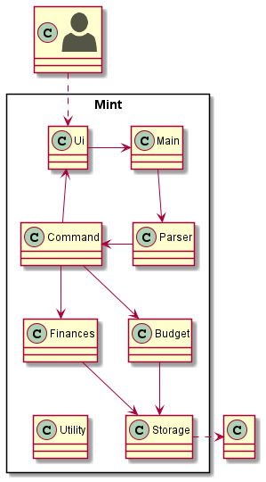
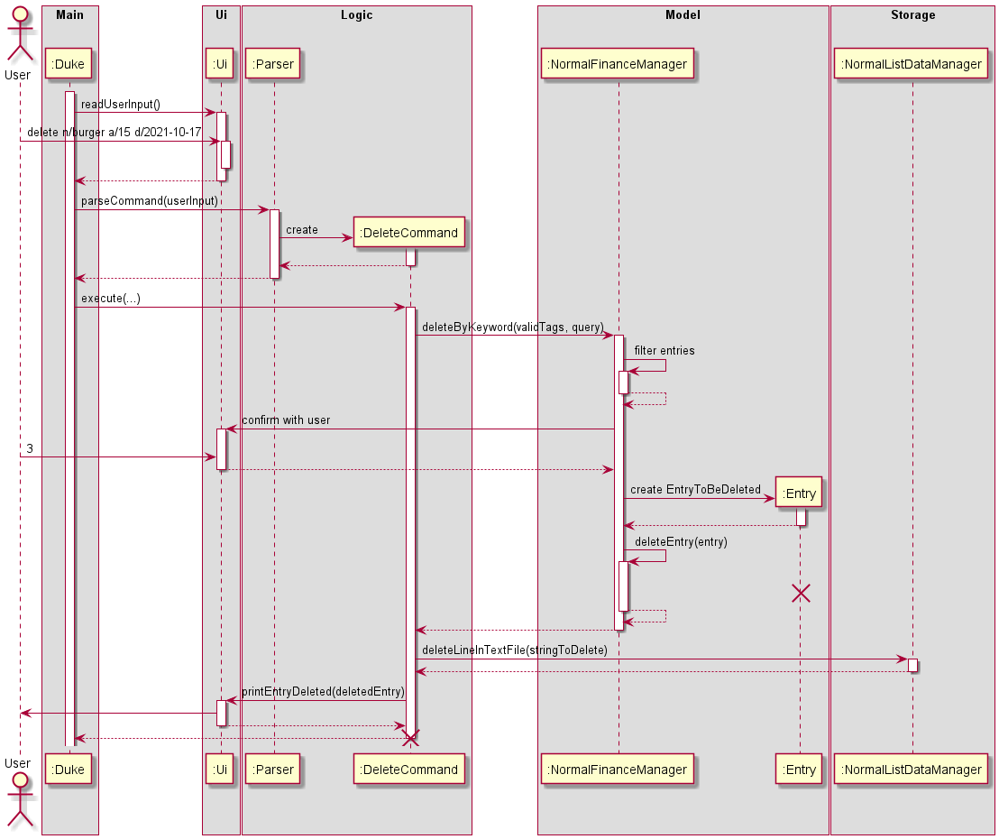
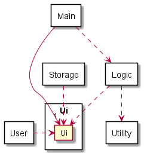
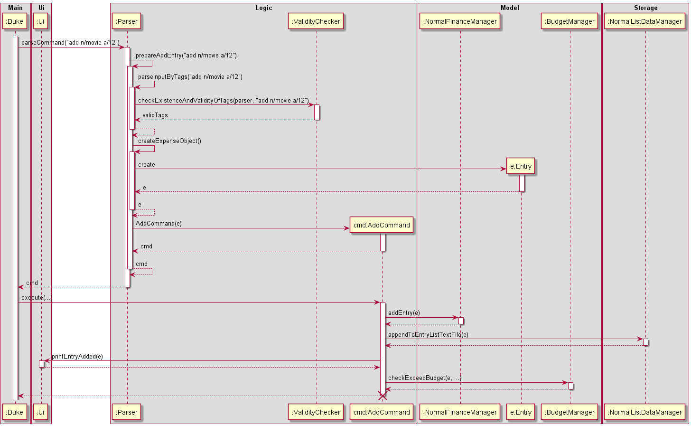
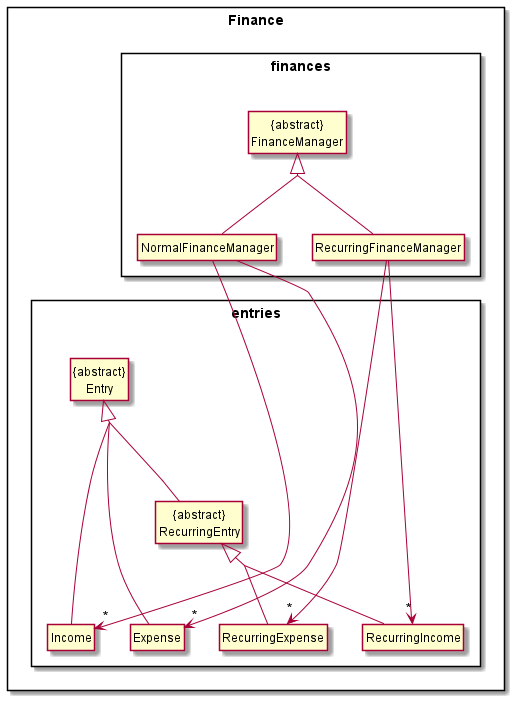
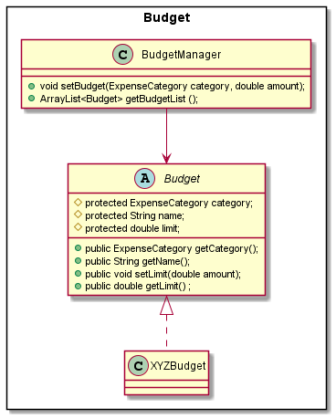
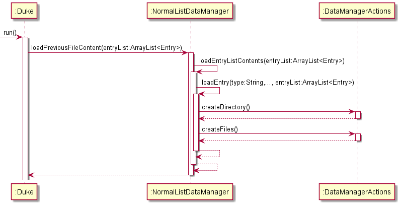
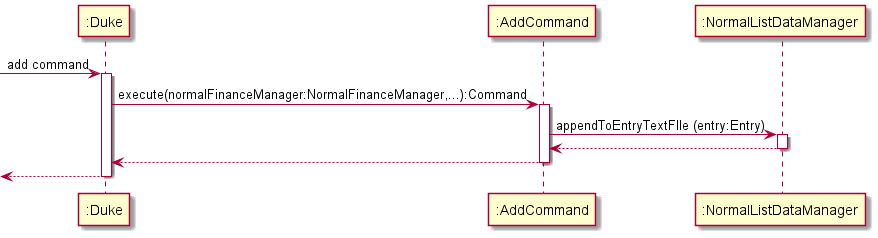

# Developer Guide

### Table of Content

- [Acknowledgements](#acknowledgements)
- [Design](#design)
    - [System Architecture](#sys-arch)
    - [Ui Component](#text-ui)
    - [Logic Component](#logic)
    - [Model Component](#model)
      - [Finance Component](#finance)
      - [Budget Component](#budget)
    - [Storage Component](#storage)
- [Implementation](#implementation)
- [Product Scope](#scope)
    - [Target user profile](#target)
    - [Value proposition](#value)
- [User Stories](#stories)
- [Non-Function Requirements](#nf-req)
- [Glossary](#glossary)
- [Instructions for manual testing](#manual-test)
    - [Adding an Item](#Adding)
    - [Deleting an Item](#delete)
    - [Editing an Item](#edit)
    - [Adding a Recurring Item](#Add-recurring-item)
    - [Deleting a Recurring Item](#Delete-recurring-item)
    - [Editing a recurring item](#Edit-recurring-item)
    - [Adding Spending Limits](#set)
    - [Viewing Spending Limits](#View-spending-limits)

## <a name="acknowledgements"></a>Acknowledgements

- Inspiration for App Idea and OOP Structure:
- Inspiration for User Guide and Developer Guide: AddressBook (Level 2) <br />
  https://se-education.org/addressbook-level3/DeveloperGuide.html <br/>
  https://se-education.org/addressbook-level3/UserGuide.html

{list here sources of all reused/adapted ideas, code, documentation, and third-party libraries -- include links to the
original source as well}

## <a name="design"></a>Design

### <a name="sys-arch"></a>System Architecture



The above **System Architecture** diagram shows the high-level design of Mint.

On launch, the `Main` class initialises the app components in the correct sequence and links them up with each other, in
the correct sequence.

Apart from `Main`, Mint comprises six main components, namely:

- `Ui`: The UI of the App 
- `Logic`: Make sense of user input and execute command
- `Model`: Holds the data of the App
- `DataManager`: Reads from and writes to [`LocalStorage`](#local-storage).

The components interact with each other, as shown in the sequence diagram below.



### <a name="text-ui"></a>Ui Component



The UI consists of a `Ui` class that represents the interface that the user interacts with.

The Ui component,

* takes in user inputs.
* pass them either to the `Logic` component or `Storage` component.
* outputs entries requested by the user.

### <a name="logic"></a>Logic Component
Here's a (partial) class diagram of the `Logic` component.


How the `Logic` component works:
1. When `Logic` is called upon to parse a command, it uses `Parser` class to parse the user command.
2. The `Parser` prepares to return a `Command` object (more precisely, an object of one of its </br >
subclasses e.g.,`AddRecurringCommand`) by parsing the arguments and verifying through `ValidityChecker` class.
3. `Parser` encapsulates the details of the query as an `Entry` object from `Model`.
4. `Parser` returns a `Command` object, which is executed by `Main`.
5. The `Command` can communicate with the `Model` when it is executed </br>
6. The `Command` saves the resulting data by using the `Storage`.
7. The result is printed to the user by the `Ui`.
   (e.g. to add a recurring entry)

The Seuquence Diagram below illustrates the interactions within the `Logic` component for the</br>
`parseCommand("delete a/12")` API call.

### <a name="model"></a>Model Component
The `Model` package consists of two components: `Finance` and `Budget`.
##### <a name="finance"></a>Finance Component


The `Finance` component,
- stores all the entry data i.e., all `Entry` objects (which are contained in `FinancialManager` object).
  - `NormalFinanceManager` object stores all the `Income` and `Expense` objects
  - `RecurringFinanceManager` stores all the `RecurringIncome` and `RecurringExpense` objects
- performs action on the list of `Entry` objects (e.g., add, delete, etc.)
- depends on Ui component as some action needs confirmation from the user (e.g. For delete, </br>
if there are multiple entries that match the tags the user specified, the user needs to choose which one to delete.)
#### <a name="budget"></a>Budget Component

#### <a name="budget"></a>Budget


The `Budget` package consists of a `BudgetManager` and the `Budget`'s each of the seven `ExpenseCategory`'s.
- `Budget` is an abstract class
- `XYZBudget`(`XYZ` is a placeholder for the specified budget e.g., `FoodBudget`), inherits `Budget` and its attributes.
- `BudgetManager` stores a list of the seven `ExpenseCategory`'s.
- Currently, `BudgetManager` only interacts in 2 ways
    - when user want to set budget for a specific category
    - when other parts of the app requires the list of budgets e.g., `Ui` needs the list to print to the user, or 
      `FinanceManager` needs to know if the user is nearing their spending limit to notify them.

### <a name="contact-list"></a>ExpenseList

### <a name="storage"></a>Storage Component

**How the `Storage` component works:**

**1. Loading the lists from the stored files:**


> For ease of visualization, since the logic for all the different lists are the same, we have broken it down to show
> one example using the diagram

1. When the program is executed, all the objects including the `BudgetDataManager`, `DataManagerActions`, 
   `NormalListDataManager` and `RecurringListDataManager` would be created. 
2. The programme would then load all the stored content from the lists which records the user's previously recorded
   normal expenditure, recurring expenditure, and the spending limits they set for each category.
3. Upon detection, missing text files, and the required directory would be created.

**2. General logic for each command:**



1. After the command is extracted from the `Parser`, `Duke` would call the respective command class. In the case of
   the add function, the `AddCommand` class would be called.
2. In the `AddCommand` class, after the add command has been successfully performed, a method call to 
   `appendToEntryListTextFile` would activate the `NormalListDataManager` class for which the added entry would be 
   appended to an external text file.
   
**The `Storage` component:**
1. Can save all the `recurringEntryList`, `budgetList` and the `entryList` in a text file. It is also able to read the 
   data from the respective text files and read them back into the corresponding objects.
2. Has four different classes. `DataManagerActions` comprises the common components used by the other two classes,
   `BudgetListDataManager`, `RecurringListDataManager` and `NormalListDataManager`. All of these classes inherit from 
   the `DataManagerActions` class.
   
## <a name="implementation"></a>Implementation

{Describe the design and implementation of the product. Use UML diagrams and short code snippets where applicable.}

{NOT DONE}

## <a name="scope"></a>Product scope

### <a name="target"></a>Target user profile
- has a need to track their expenses and savings
- prefer desktop apps over other types
- can type fast
- prefers typing to mouse interactions
- is reasonably comfortable using CLI apps

### <a name="value"></a>Value proposition

A smart and simple way to keep track of your expenses

## <a name="stories"></a>User Stories

|Version| As a ... | I want to ... | So that I can ...|
|--------|----------|---------------|------------------|
|v1.0|new user|see usage instructions|refer to them when I forget how to use the application|
|v1.0|user|add expense|
|v1.0|user|delete expense|remove entries that I no longer need|
|v1.0|user|view past expenses|keep track of my spending|
|v1.0|user|edit past expenses|avoid deleting the entire expense if I only made a small error while keying it in|
|v2.0|user|set spending limit|cut down on unnecessary spending|
|v2.0|user|sort spending by amount|see which expenditure is taking up the budget|
|v2.0|user|find a particular Expense by name|locate an Expense without having to go through the entire list|
|v2.0|user|add recurring expenses|keep track of them and take them into account every month|
|v2.0|user|add income|better estimate my spending capacity|

## <a name="nf-req"></a>Non-Functional Requirements

- Should work on any [*mainstream Operating Systems*](#os) as long as Java `11` or higher has been installed on it.
- Each command (Add, delete, edit, view) should be executed within 1 second of the user input.
- Users can use the application throughout the week at any time during the day. In the case of unexpected downtime, all
  features will be available again within 24 hours.
- If the commands have errors, they can be fixed within 24 hours.
- The application’s interface has to be intuitive and easy to use.

## <a name="glossary"></a>Glossary

* <a name="os"></a>**Mainstream Operating Systems** - Windows, macOS, *NIX
* <a name="local-storage"></a>**LocalStorage** - Refers to user's hard disk storage

## <a name="manual-test"></a>Instructions for manual testing
> We define an 'item' as an expense/income

### <a name="Adding"></a>Adding an Item

**Prerequisites**

- The list must have been initialized.

**Test case 1: Adding an item with all fields specified.**

**Usage:**

- Add an Expense: `add a/[amount] n/[description] d/[date] c/[categoryNumber]`
- Add an Income: `add income a/[amount] n/[description] d/[date] c/[categoryNumber]`
- Some fields such as `n/[description]` and `a/[amount]` must be specified. If the user prefers,
  additional fields can be added for greater specificity. The fields can be specified in any order.

**Expected**

- Program would print a message to notify the user that the item has been added.
- An item would then be added to the list.
- Optional fields that are missing would be set to the default pre-determined by the programme.

**[EXPENSE] Example of usage and expected output:**

```
add a/15 d/2021-12-03 n/Textbook c/7
I've added: Expense  | OTHERS | 2021-12-03 | Textbook | $15.00
```

**[INCOME] Example of usage and expected output:**

```
add income a/15 d/2021-12-03 n/Selling Textbooks c/7
I've added: Income  | OTHERS | 2021-12-03 | Selling Textbooks | $15.00
```
**Test case 2: Adding an item with some fields specified.**

**Usage:**

- Add an Expense: `add [include some fields of the expense you would like to add]`
- Add an Income: `add income [include some fields of the income you would like to add]`
- Some fields such as `n/[description]` and `a/[amount]` must be specified. If the user prefers,
  additional fields can be added for greater specificity. The fields can be specified in any order.

**Expected**

- Program would print a message to notify the user that the item has been added.
- An item would then be added to the list.
- Optional fields that are missing would be set to the default pre-determined by the programme.

**[EXPENSE] Example of usage and expected output:**
```
add a/15 d/2021-12-03 n/Textbook
I've added: Expense  | OTHERS | 2021-12-03 | Textbook | $15.00
```
```
add a/5 n/Chicken Rice c/0
I've added: Expense  | FOOD | 2021-10-27 | Chicken Rice | $5.00
```
```
add n/Cheese Burger a/23.5
I've added: Expense  | OTHERS | 2021-10-27 | Cheese Burger | $23.50
```
**[INCOME] Example of usage and expected output:**

```
add income a/15 d/2021-12-03 n/Selling Textbooks
I've added: Expense  | OTHERS | 2021-12-03 | Selling Textbooks | $15.00
```
```
add income a/5 n/Selling Textbooks c/0
I've added: Income  | ALLOWANCE | 2021-10-27 | Selling Textbooks | $5.00
```
```
add income n/Selling Textbooks a/23.5
I've added: Income  | OTHERS | 2021-10-27 | Selling Textbooks | $23.50
```

### <a name="delete"></a>Deleting an Item

**Prerequisites**

- The list must have items that have already been added.

**Test case 1: Deleting an existing item with some fields specified. Only one item
exists that matches all the fields specified.**

**Usage:**

- Delete an Expense: `delete [include some fields of the expense you would like to delete]`
- Delete an Income: `delete income [include some fields of the income you would like to delete]`
- At least one field must be specified. If the user prefers, additional tags can be added for greater
  specificity. The fields can be specified in any order.

**Expected**

- It asks user if the user wants to delete the found item.
- When user inputs y, it would delete the item.

**[EXPENSE] Example of usage and expected output:**

```
delete n/Movie c/1
Is this what you want to delete?
    Expense  | ENTERTAINMENT | 2021-12-03 | Movie | $20.00
Type "y" if yes. Type "n" if not.
y
I have deleted: Expense  | ENTERTAINMENT | 2021-12-03 | Movie | $20.00
```
**[INCOME] Example of usage and expected output:**

```
delete income n/Selling Textbooks c/0
Is this what you want to delete?
    Income  | ALLOWANCE | 2021-10-27 | Selling Textbooks | $5.00
Type "y" if yes. Type "n" if not.
y
I have deleted: Income  | ALLOWANCE | 2021-10-27 | Selling Textbooks | $5.00
```

**Test case 2: Choosing not to delete an existing item after entering the delete command.**

**Usage:**

- Delete an Expense: `delete [include some fields of the expense you would like to delete]`
- Delete an Income: `delete income [include some fields of the income you would like to delete]`
- At least one field must be specified. If the user prefers, additional tags can be added for greater
  specificity. The fields can be specified in any order.

**Expected**

- It asks user if the user wants to delete the found item.
- When user inputs n, it exits the delete process.

**[EXPENSE] Example of usage and expected output:**

```
delete a/90 d/2021-12-03 n/phone bills c/3 
Is this what you want to delete?
    Expense |    HOUSEHOLD     | 2021-12-03 |   phone bills    |-$90.00
Type "y" if yes. Type "n" if not.
n
Ok. I have cancelled the process.
```
**[INCOME] Example of usage and expected output:**

```
delete income a/90 d/2021-12-03 n/collecting phone bills c/3 
Is this what you want to delete?
    Income  | INTEREST | 2021-12-03 | collecting phone bills | $90.00
Type "y" if yes. Type "n" if not.
n
Ok. I have cancelled the process.
```


### <a name="edit"></a>Editing an Item

**Prerequisites**

- The list must have items that have already been added.
- At least one field must be specified. If the user prefers, additional tags can be added for greater
  specificity. The fields can be specified in any order.

**Test case 1: Editing all fields.**

**Usage:**

- Editing an Expense: `edit [include all fields of expense you would like to edit]`
- Editing an Income: `edit [include all fields of income you would like to edit]`
- At least one field must be specified. If the user prefers, additional tags can be added for greater
  specificity. The fields can be specified in any order.

**CAUTION**
- Do not edit the same field multiple times in one command.

**Expected**

- The user would be prompted to choose their item to edit if there are multiple items or confirm their edit.
- The input fields of the selected entry are updated and there would be a message printed to notify the users that
  the changes have been made.

**[EXPENSE] Example of usage and expected output:**

```
edit a/20 d/2021-12-03 n/Movie c/1
Is this what you want to edit?
    Expense  | ENTERTAINMENT | 2021-12-03 | Movie | $20.00
Type "y" if yes. Type "n" if not.
y
What would you like to edit?
a/8 n/Chicken Rice c/0 d/2000-09-22
Got it! I will update the fields accordingly!
```
**[INCOME] Example of usage and expected output:**

```
edit income a/20 d/2021-12-03 n/Full-time job c/1
Is this what you want to edit?
    Expense  | ENTERTAINMENT | 2021-12-03 | Movie | $20.00
Type "y" if yes. Type "n" if not.
y
What would you like to edit?
n/part-time job
Got it! I will update the fields accordingly!
```

**Test case 2: Editing some fields.**

**Usage:**

- Editing an Expense: `edit [include all fields of expense you would like to edit]`
- Editing an Income: `edit income [include all fields of income you would like to edit]`
- At least one field must be specified. If the user prefers, additional tags can be added for greater
  specificity. The fields can be specified in any order.

**CAUTION**
- Do not edit the same field multiple times in one command.

**Expected**

- The user would be prompted to choose their item to edit if there are multiple items or confirm their edit.
- The input fields of the selected entry are updated and there would be a message printed to notify the users that
  the changes have been made.

**[EXPENSE] Example of usage and expected output:**

```
edit a/20 d/2021-12-03 n/Movie c/2
Is this what you want to edit?
    Expense  | ENTERTAINMENT | 2021-12-03 | Movie | $20.00
Type "y" if yes. Type "n" if not.
y
What would you like to edit?
a/8 c/0 
Got it! I will update the fields accordingly!
```
**[INCOME] Example of usage and expected output:**

```
edit income n/Full-time job
Is this what you want to edit?
    Income  | WAGES | 2021-12-03 | Full-time job | $20.00
Type "y" if yes. Type "n" if not.
y
What would you like to edit?
n/Part-time job
Got it! I will update the fields accordingly!
```


### <a name="Add-recurring-item"></a>Adding a Recurring Item

**Prerequisites**

- The list must have been initialized.

**Test case 1: Adding an existing recurring item with all fields specified.**

**Usage:**

- Adding a Recurring Expense:`addR a/[amount] n/[description] c/[category] i/[interval] e/[end date] d/[start date]`
- Adding a Recurring Income:`addR income a/[amount] n/[description] c/[category] i/[interval] e/[end date]
  d/[start date]`
- Some fields such as `n/[description]`, `a/[amount]` and `i/[interval]` must be specified. If the user prefers,
  additional fields can be added for greater specificity. The fields can be specified in any order.

**Expected**

- Program would print a message to notify the user that the item has been added.
- An item would then be added to the list.
- Optional fields that are missing would be set to the default pre-determined by the programme.

**[EXPENSE] Example of usage and expected output:**

```
addR a/90 d/2021-12-03 n/phone bills c/3 i/MONTH e/2023-04-15
I've added: Expense | HOUSEHOLD | 2021-12-03 | phone bills |-$90.00 | MONTH | 2023-04-15
```
**[INCOME] Example of usage and expected output:**

```
addR income a/20 d/2021-12-03 n/Full-time job c/1 i/MONTH e/2023-04-15
I've added: Income  | WAGES | 2021-12-03 | Full-time job | $20.00 | MONTH | Forever :D
```

**Test case 2: Adding an existing recurring item with some fields specified.**

**Usage:**

- Adding a Recurring Expense:`addR [include some fields of the expense you would like to add as recurring expense]`
- Adding a Recurring Income:`addR income [include some fields of the expense you would like to add as
  recurring expense]`
- Some fields such as `n/[description]`, `a/[amount]` and `i/[interval]` must be specified. If the user prefers,
  additional fields can be added for greater specificity. The fields can be specified in any order.

**Expected**

- Program would print a message to notify the user that the item has been added.
- An item would then be added to the list.
- Optional fields that are missing would be set to the default pre-determined by the programme.

**[EXPENSE] Example of usage and expected output:**

```
addR a/90 d/2021-12-03 n/phone bills c/3 i/MONTH
I've added: Expense | HOUSEHOLD | 2021-12-03 | phone bills |-$90.00 | MONTH | Forever :D
```
```
addR a/5 n/phone bills c/3 i/MONTH
I've added: Expense | HOUSEHOLD | 2021-10-27 | phone bills |-$5.00 | MONTH | Forever :D
```
```
addR a/5 n/phone bills d/2021-10-10 i/MONTH
I've added: Expense | OTHERS | 2021-10-10 | phone bills |-$5.00 | MONTH | Forever :D
```
**[INCOME] Example of usage and expected output:**

```
addR income a/90 d/2021-12-03 n/Full-time job c/1 i/MONTH
I've added: Income  | WAGES | 2021-12-03 | Full-time job | $90.00 | MONTH | Forever :D
```
```
addR income a/90 n/Full-time job c/1 i/MONTH
I've added: Income  | WAGES | 2021-10-27 | Full-time job | $90.00 | MONTH | Forever :D
```
```
addR income a/90 n/Full-time job d/2021-10-10 i/MONTH
I've added: Income  | OTHERS | 2021-10-10 | Full-time job | $90.00 | MONTH | Forever :D
```

### <a name="Delete-recurring-item"></a>Deleting a Recurring Item

**Prerequisites**

- The list must have been initialized.

**Test case 1: Deleting an existing recurring item with all fields specified.**

**Usage:**

- Deleting a Recurring Expense: `deleteR a/[amount] n/[description] d/[date] c/[categoryNumber] i/[interval]
  e/[endDate]`
- Deleting a Recurring Income: `deleteR income a/[amount] n/[description] d/[date] c/[categoryNumber] i/[interval]
  e/[endDate]`
- At least one field must be specified. If the user prefers, additional tags can be added for greater.
  specificity. The fields can be specified in any order.
- For the delete function, we can delete both the expense and income using the same command `deleteR`

**Expected**

- It asks user if the user wants to delete the found item.
- When user inputs y, it deletes the item.

**[EXPENSE and INCOME] Example of usage and expected output:**

```
deleteR a/90 d/2021-12-03 n/phone bills c/4 i/MONTH e/2023-04-15
Is this what you want to delete?
    Expense | APPAREL | 2021-12-03 | phone bills |-$90.00 | MONTH | 2023-04-15
Type "y" if yes. Type "n" if not.
y
I have deleted: Expense | APPAREL | 2021-12-03 | phone bills |-$90.00 | MONTH | 2023-04-15
```
```
deleteR a/20 d/2021-12-03 n/Full-time job c/1 i/MONTH e/2023-04-15
Is this what you want to delete?
    Income  | WAGES | 2021-12-03 | Full-time job | $20.00 | MONTH | Forever :D
Type "y" if yes. Type "n" if not.
y
I have deleted: Income  | WAGES | 2021-12-03 | Full-time job | $20.00 | MONTH | Forever :D
```

**Test case 2: Deleting an existing recurring item with some fields specified.**

**Usage:**

- Deleting a Recurring Expense: `deleteR [include some fields of the recurring expense you would like to delete]`
- Deleting a Recurring Income: `deleteR income [include some fields of the recurring Income you would like to delete]`
- At least one field must be specified. If the user prefers, additional tags can be added for greater.
  specificity. The fields can be specified in any order.
- For the delete function, we can delete both the expense and income using the same command `deleteR`


**Expected**

- It asks user if the user wants to delete the found item.
- When user inputs y, it deletes the item.

**[EXPENSE and INCOME] Example of usage and expected output:**

```
deleteR a/90 d/2021-12-03 n/phone bills c/3 i/MONTH
Is this what you want to delete?
    Expense | HOUSEHOLD | 2021-12-03 | phone bills |-$90.00 | MONTH | Forever :D
Type "y" if yes. Type "n" if not.
y
I have deleted: Expense | HOUSEHOLD | 2021-12-03 | phone bills |-$90.00 | MONTH | Forever :D
```
```
deleteR a/5 n/phone bills c/4 i/MONTH
Is this what you want to delete?
    Expense | APPAREL | 2021-10-27 | phone bills |-$5.00 | MONTH | Forever :D
Type "y" if yes. Type "n" if not.
y
I have deleted: Expense | APPAREL | 2021-10-27 | phone bills |-$5.00 | MONTH | Forever :D
```
```
deleteR a/5 n/phone bills d/2021-10-10 i/MONTH
Is this what you want to delete?
    Expense | OTHERS | 2021-10-10 | phone bills |-$5.00 | MONTH | Forever :D
Type "y" if yes. Type "n" if not.
y
I have deleted: Expense | OTHERS | 2021-10-10 | phone bills |-$5.00 | MONTH | Forever :D
```
```
deleteR a/20 d/2021-12-03 n/Full-time job c/1 i/MONTH
Is this what you want to delete?
    Income  | WAGES | 2021-12-03 | Full-time job | $20.00 | MONTH | Forever :D
Type "y" if yes. Type "n" if not.
y
I have deleted: Income  | WAGES | 2021-12-03 | Full-time job | $20.00 | MONTH | Forever :D
```
```
deleteR a/20 n/Full-time job c/1 i/MONTH
Is this what you want to delete?
    Income  | WAGES | 2021-12-03 | Full-time job | $20.00 | MONTH | Forever :D
Type "y" if yes. Type "n" if not.
y
I have deleted: Income  | WAGES | 2021-12-03 | Full-time job | $20.00 | MONTH | Forever :D
```
```
deleteR a/20 n/Full-time job d/2021-10-10 i/MONTH
Is this what you want to delete?
    Income  | OTHERS | 2021-10-10 | Full-time job | $20.00 | MONTH | Forever :D
Type "y" if yes. Type "n" if not.
y
I have deleted: Income  | OTHERS | 2021-10-10 | Full-time job | $20.00 | MONTH | Forever :D
```

**Test case 3: Choosing not to delete an existing expense after entering the delete command.**

**Usage:**

- Deleting a Recurring Expense: `deleteR [include some fields of the recurring expense you would like to delete]`
- Deleting a Recurring Income: `deleteR income [include some fields of the recurring Income you would like to delete]`
- At least one field must be specified. If the user prefers, additional tags can be added for greater.
  specificity. The fields can be specified in any order.
- For the delete function, we can delete both the expense and income using the same command `deleteR`


**Expected**

- It asks user if the user wants to delete the found item.
- When user inputs n, it exits the delete process.

**[EXPENSE and INCOME] Example of usage and expected output:**

```
deleteR a/90 d/2021-12-03 n/phone bills c/3 i/MONTH
Is this what you want to delete?
    Expense | HOUSEHOLD | 2021-12-03 | phone bills |-$90.00 | MONTH | Forever :D
Type "y" if yes. Type "n" if not.
n
Ok. I have cancelled the process.
```
```
deleteR a/20 d/2021-12-03 n/Full-time job c/1 i/MONTH
Is this what you want to delete?
    Income  | WAGES | 2021-12-03 | Full-time job | $20.00 | MONTH | Forever :D
Type "y" if yes. Type "n" if not.
n
Ok. I have cancelled the process.
```

### <a name="Edit-recurring-item"></a>Editing a recurring item

**Prerequisites**

- The list must have expenses that have already been added.
- At least one field must be specified. If the user prefers, additional tags can be added for greater
  specificity. The fields can be specified in any order.

**Test case 1: Editing an existing recurring item with all fields specified.**

**Usage:**

- Editing a Recurring item: `editR a/[amount] n/[description] d/[date] c/[categoryNumber] i/[Interval] e/[end date]`
- At least one field must be specified. If the user prefers, additional tags can be added for greater
  specificity. The fields can be specified in any order.
- For the edit function, we can edit both the expense and income using the same command `editR`

**Expected**

- The user would be prompted to choose their item to edit if there are multiple items or confirm their edit.
- The input fields of the selected item are updated and there would be a message printed to notify the users that
  the changes have been made.

**[EXPENSE and INCOME] Example of usage and expected output:**

```
editR a/15 n/phone bills d/2021-12-03 c/0 i/MONTH e/2023-10-10
Is this what you want to edit?
    Expense | FOOD | 2021-12-03 | phone bills |-$15.00 | MONTH | 2023-10-10
Type "y" if yes. Type "n" if not.
y
What would you like to edit?
a/40
Got it! I will update the fields accordingly!
```
```
editR a/20 d/2021-12-03 n/Full-time job c/1 i/MONTH e/2023-10-10
Is this what you want to edit?
    Income  | WAGES | 2021-12-03 | Full-time job | $20.00 | MONTH | Forever :D
Type "y" if yes. Type "n" if not.
y
What would you like to edit?
a/100
Got it! I will update the fields accordingly!
```
**Test case 2: Editing an existing recurring item with some fields specified.**

**Usage:**

- Editing a Recurring Expense:`editR [include some fields of the recurring expense you would like to edit]`
- Editing a Recurring Income:`editR [include some fields of the recurring income you would like to edit]`
- At least one field must be specified. If the user prefers, additional tags can be added for greater.
  specificity. The fields can be specified in any order.
- For the edit function, we can edit both the expense and income using the same command `editR`

**Expected**

- The user would be prompted to choose their item to edit if there are multiple items or confirm their edit.
- The input fields of the selected items are updated and there would be a message printed to notify the users that
  the changes have been made.

**[EXPENSE and INCOME] Example of usage and expected output:**

```
editR a/40 n/Netflix Subscription c/1 
Is this what you want to edit?
    Expense | ENTERTAINMENT | 2021-10-27 | Netflix Subscription |-$40.00 | MONTH | Forever :D
Type "y" if yes. Type "n" if not.
y
What would you like to edit?
a/20
Got it! I will update the fields accordingly!
```
```
editR n/Full-time job
Here is the list of items containing the keyword.
    1  Income  | WAGES | 2021-12-03 | Full-time job | $90.00 | MONTH | Forever :D
    2  Expense | ENTERTAINMENT | 2021-10-27 | Full-time job |-$90.00 | MONTH | Forever :D
    3  Income  | WAGES | 2021-10-27 | Full-time job | $90.00 | MONTH | Forever :D
    4  Income  | OTHERS | 2021-10-10 | Full-time job | $90.00 | MONTH | Forever :D
    5  Income  | WAGES | 2021-12-03 | Full-time job | $20.00 | MONTH | Forever :D
    6  Income  | WAGES | 2021-12-03 | Full-time job | $100.00 | MONTH | Forever :D
Enter the index of the item you want to edit. To cancel, type "cancel"
1
What would you like to edit?
n/part-time job
Got it! I will update the fields accordingly!
```
### <a name="set"></a>Adding Spending Limits

**Prerequisites**

- The list must have expenses that have already been added.

**Test case 1: Adding a spending limit.**

**Usage:**

- Add spending limit to desired category: `set c/[catNum] a/[amount]`
- All fields must be specified

**Expected**

- If added correctly, a spending limit would be applied to the desired category.

**Example of usage and expected output:**
```
set c/0 a/100
Budget for FOOD set to $100.00
```
### <a name="View-spending-limits"></a>Viewing Spending Limits

**Prerequisites**

- The list must have expenses that have already been added.

**Test case 1: Viewing a spending limit.**

**Usage:**

- View spending limits for each category: `budget`

**Expected**

- If the entire list with all the categories and spending limits for each category would be displayed.

**Example of usage and expected output:**
```
budget
Here is the budget for the month.
      FOOD       | $5.00 / $100.0
 ENTERTAINMENT   | $0.00 / Not set
 TRANSPORTATION  | $0.00 / Not set
   HOUSEHOLD     | $0.00 / Not set
    APPAREL      | $0.00 / Not set
     BEAUTY      | $0.00 / Not set
      GIFT       | $0.00 / Not set
     OTHERS      | $23.50 / Not set
```

### <a name="View"></a>Viewing entries

**Prerequisites**

- The list must have been initialized.

**Test case 1: View with no fields specified.**

**Usage:**

- `view`

**Expected**

- Program would print a message to notify the user the viewing options that have been selected.
- A table of entries that fulfill the viewing options will be printed out.

**Example of usage and expected output:**

```
view
--------------------------------------------------------------------
Here is the list of your entries:
  Type  |     Category     |    Date    |   Name   | Amount  | Every |   Until
Expense |      OTHERS      | 2021-04-20 | Textbook |-$15.00 
Expense |      OTHERS      | 2020-01-06 |  Burger  |-$4.20  
Income  |    INVESTMENT    | 2021-10-27 |  Sales   | $32.00 
                                        Net Total: | $12.80
Here is the information about your recurring entries:
```
**Test case 2: View with some fields specified.**

**Usage:**

- `view income/expense by [Sort Type] month [month] year [year] from [Start Date] [End Date] up/ascending`
- Any number of fields can be specified. If the user prefers, additional modifiers can be added for greater
  specificity. The fields can be specified in any order other than `income/expense`, which has to be right after `view`.

**Expected**

- Program would print a message to notify the user the viewing options that have been selected.
- A table of entries that fulfill the viewing options will be printed out.
- Optional fields that are missing would be set to the default pre-determined by the programme.

**Example of usage and expected output:**

```
view income
--------------------------------------------------------------------
Here is the list of your entries:
  Type  |     Category     |    Date    | Name  | Amount  | Every |   Until
Income  |    INVESTMENT    | 2021-10-27 | Sales | $32.00 
                                     Net Total: | $32.00
Here is the information about your recurring entries:
```
```
view month 4 year 2021
--------------------------------------------------------------------
For the year 2021:
For the month of APRIL:
Here is the list of your entries:
  Type  |     Category     |    Date    |   Name   | Amount  | Every |   Until
Expense |      OTHERS      | 2021-04-20 | Textbook |-$15.00 
                                        Net Total: |-$15.00
For the year 2021:
For the month of APRIL:
Here is the information about your recurring entries:
```
```
view from 2021-03-25 2022-01-02 by amount ascending
--------------------------------------------------------------------
Here is the list of your entries:
Since 2021-03-25 to 2022-01-02:
  Type  |     Category     |    Date    |   Name   | Amount  | Every |   Until
Expense |      OTHERS      | 2021-04-20 | Textbook |-$15.00 
Income  |    INVESTMENT    | 2021-10-27 |  Sales   | $32.00 
                                        Net Total: | $17.00
```
